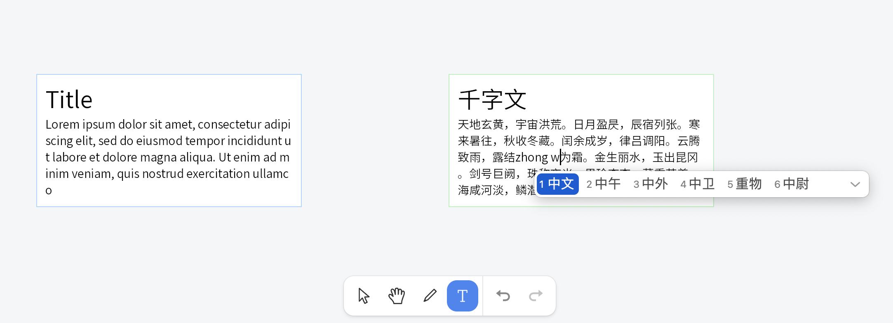

# neditor

a rich text editor on a port of Cobalt to JavaScript aimed at running in Canvas.

## DEMO
[waisiukei.github.io/neditor](https://waisiukei.github.io/neditor/)



## Goals

- Produce a rich text editor in pure JavaScript that supports rendering to WebGL/Canvas contexts.
- Develop a framework for prototyping CSS Houdini, HTML elements and attributes.

## Contributing

### Getting around the code

* `/packages/neditor/base` This is utils functions.
* `/packages/neditor/canvas` It holds codes of canvas core.
* `/packages/neditor/engine` This is a port of Cobalt to JavaScript.
* `/packages/neditor/platform` Vscode platform features.
* `/packages/neditor/workbench` User interface and functionality extensions..
* `/third_party/css-parser` This is a simple parser of HTML inline style.
* `/third_party/icu` This is a port of ICU to Web.
* `/third_party/skia` Loader of Skia/CanvasKis and its Typescript definations.

## Building

### Bootstrap

```shell script
yarn
```

### Dev

```shell script
yarn start
```

### Build

```shell script
yarn start
```

## License

MIT License

Copyright (c) 2020-2023 Waisiukei
